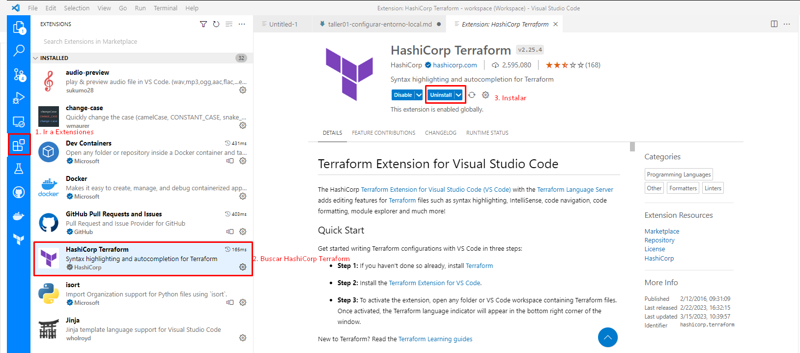
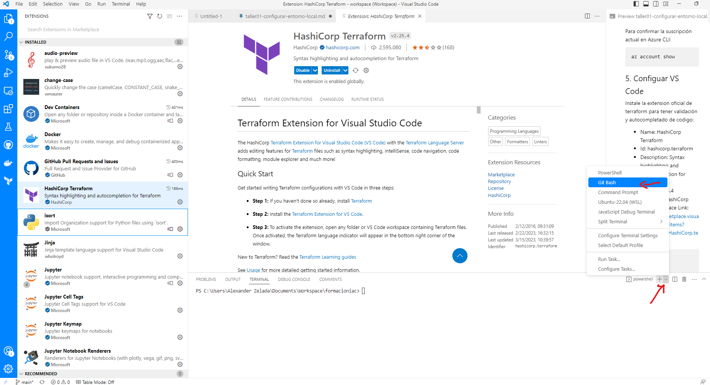
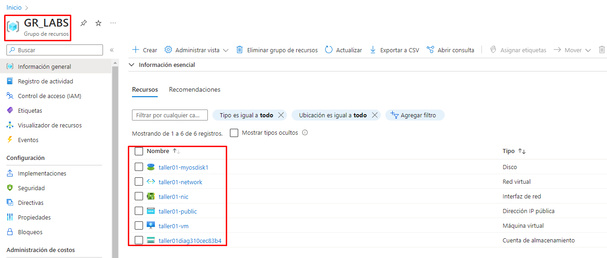

# Configurar entorno de trabajo

## 1. Instalar el CLI de Azure

**Ubuntu**:

Ejecute el siguiente comando en el terminal:

```bash
curl -sL [https://aka.ms/InstallAzureCLIDeb](https://aka.ms/InstallAzureCLIDeb) | sudo bash
```

[Instalación de la CLI de Azure en Linux](https://learn.microsoft.com/es-es/cli/azure/install-azure-cli-linux?pivots=apt)

**Windows:**

Descargue el ejecutable de esta web:

[Instalación de la CLI de Azure para Windows](https://learn.microsoft.com/es-es/cli/azure/install-azure-cli-windows?tabs=azure-cli)

Después de ejecutar los pasos anteriores, debemos iniciar sesión en la CLI de Azure con el siguiente comando:

```bash
~$ az login
######################RESULTADO DEL COMANDO##########################
A web browser has been opened at https://login.microsoftonline.com/organizations/oauth2/v2.0/authorize. Please continue the login in the web browser. If no web browser is available or if the web browser fails to open, use device code flow with `az login --use-device-code`.
The following tenants dont contain accessible subscriptions. Use 'az login --allow-no-subscriptions' to have tenant level access.
[
  {
    "cloudName": "AzureCloud",
    "homeTenantId": "TENANTD_ID",
    "id": "851476e7f18f4ea4337b0d83165d4396",
    "isDefault": true,
    "managedByTenants": [],
    "name": "COMPANY_NAME",
    "state": "Enabled",
    "tenantId": "TENANTD_ID",
    "user": {
      "name": "USUARIO@MAIL.COM",
      "type": "user"
    }
  }
]
```

Para obtener el nombre y el id de la suscripción, ejecuta el siguiente comando:

```bash
~$ az account list --query "[?user.name=='USUARIO@MAIL.COM'].{Name:name, ID:id, Default:isDefault}" --output Table
Name        ID                                    Default
----------  ------------------------------------  ---------
COMPANY_NAME 851476e7f18f4ea4337b0d83165d4396        True
```

## 2. Terraform

**Ubuntu**

Para instalar Terraform, ejecute los siguientes comandos:

```bash
wget -O- https://apt.releases.hashicorp.com/gpg | gpg --dearmor | sudo tee /usr/share/keyrings/hashicorp-archive-keyring.gpg
echo "deb [signed-by=/usr/share/keyrings/hashicorp-archive-keyring.gpg] https://apt.releases.hashicorp.com $(lsb_release -cs) main" | sudo tee /etc/apt/sources.list.d/hashicorp.list
sudo apt update && sudo apt install terraform
```

**Windows**

- Descarga el archivo ejecutable desde esta página web: 
  - [Install | Terraform | HashiCorp Developer](https://developer.hashicorp.com/terraform/downloads)
- Extrae el ejecutable en un directorio (por ejemplo c:\terraform)
- Actualiza las variables de entorno
- Abre una nueva ventana del terminal
- Verifica la configuración de global path con:
```bash 
terraform -version
```

## 3. Crear Service Principal

Si estás ejecutando esto desde Git Bash, ejecuta el siguiente comando:

```bash
export MSYS_NO_PATHCONV=1 // Evitar conversion automática de rutas
```

Las herramientas que utilizar servicios de Azure, como Terraform, siempre deben tener permisos restringidos. En lugar que las aplicaciones inicien sesión como usuarios privilegiados, Azure ofrece service principals.

```powershell
az ad sp create-for-rbac --name SP_SERVICE_PRINCIPAL_NAME --role Contributor --scopes /subscriptions/<subscription_id>
######################RESULTADO DEL COMANDO##########################
{
  "appId": "6666666-8888-42de-98a6-acc9B5646",
  "displayName": "SP_SERVICE_PRINCIPAL_NAME",
  "password": "67tF5~8ZghI8fREw5Uw1gdc0sZPeMc5Ef-bLGaWV",
  "tenant": "TENANTD_ID"
}
```

## 4. Autenticación de Terraform en Azure

**Ubuntu**

Edite el archivo ~/.bashrc y añada las variables de entorno:

```bash
export ARM_SUBSCRIPTION_ID="<azure_subscription_id>"
export ARM_TENANT_ID="<azure_subscription_tenant_id>"
export ARM_CLIENT_ID="<service_principal_appid>"
export ARM_CLIENT_SECRET="<service_principal_password>"
```

Ejecutar el archivo ~/.bashrc

```bash
. ~/.bashrc
```

Verificar valores

```bash
printenv | grep ^ARM*
```

**Windows**:

Establecer las variables de entorno en una sesión específica de Powershell

```powershell
$env:ARM_CLIENT_ID="<service_principal_app_id>"
$env:ARM_SUBSCRIPTION_ID="<azure_subscription_id>"
$env:ARM_TENANT_ID="<azure_subscription_tenant_id>"
$env:ARM_CLIENT_SECRET="<service_principal_password>"
```

Verificar las variables de entorno definidas:

```powershell
gci env:ARM_*
```

Para confirmar la suscripción actual en Azure CLI:

```powershell
az account show
```

## 5. Configuar VS Code

Instale la extension oficial de terraform para tener validación y autocompletado de codigo:

- Name: HashiCorp Terraform
- Id: hashicorp.terraform
- Description: Syntax highlighting and autocompletion for Terraform
- Version: 2.25.4
- Publisher: HashiCorp
- VS Marketplace Link: https://marketplace.visualstudio.com/items?itemName=HashiCorp.terraform




Agregue terminal de Git Bash:




# Demo

Abre el terminal de Git Bash y genera la clave SSH usando el siguiente comando :

```bash
ssh-keygen
```

Clona el repositorio del taller ejecutando git clone:

```bash
git clone https://github.com/lzeladam/formacioniac.git
```

Después de clonar el repositorio, nos dirigimos al directorio demo01:

```bash
cd \formacioniac\taller01\demo01
```

Una vez que estemos dentro de la carpeta demo01, ejecutaremos los siguientes comandos de manera secuencial:

```bash
terraform init --upgrade
terraform validate
terraform plan
```

Para construir la infraestructura, ejecutamos:

```bash
terraform apply
```

Una vez ejecutados los comandos anteriores, podremos ver la siguiente infraestructura en el grupo de recursos GR_LABS:



Ahora debes conectarte a la maquina virtual utilizando el siguiente comando:

```bash
 ssh -i ~/.ssh/id_rsa testadmin@IP_PUBLICA
```

Ahora procede a eliminar la infraestructura. Antes de hacerlo, genera un plan de lo que vas a destruir ejecutando el siguiente comando:

```bash
terraform plan --destroy
```

Finalmente, si estás conforme con el plan generado, procede a destruir la infraestructura ejecutando el siguiente comando:

```bash
terraform apply --destroy 
```

## Enlaces de interés

- [https://www.msys2.org/docs/filesystem-paths/](https://www.msys2.org/docs/filesystem-paths/)
- [https://learn.microsoft.com/es-es/cli/azure/install-azure-cli-linux?pivots=apt](https://learn.microsoft.com/es-es/cli/azure/install-azure-cli-linux?pivots=apt)
- [https://learn.microsoft.com/es-es/cli/azure/install-azure-cli-windows?tabs=azure-cli](https://learn.microsoft.com/es-es/cli/azure/install-azure-cli-windows?tabs=azure-cli)
- [https://developer.hashicorp.com/terraform/downloads](https://developer.hashicorp.com/terraform/downloads)