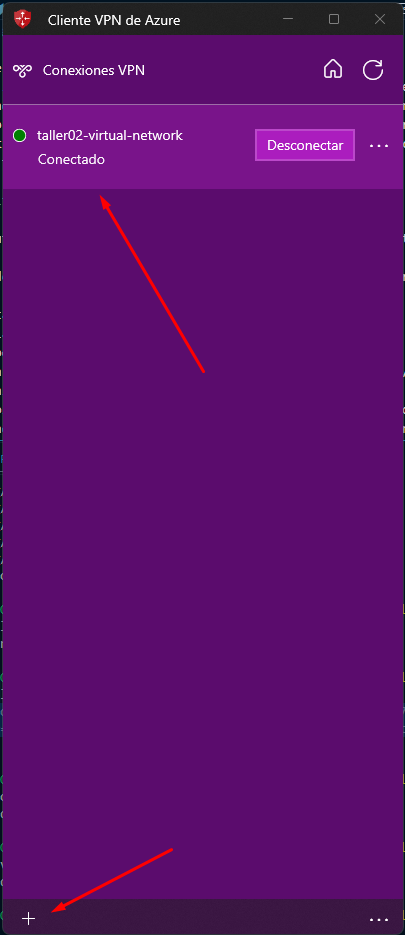

# Descripción general

Este script de Terraform crea una virtual network en Azure con una subred interna y una subred para una puerta de enlace, una virtual machine linux con gitlab instalada y una virtual machine con windows. También crea un network security group para permitir cierto tráfico de red y asocia la subred interna con el network security group. Finalmente, crea una puerta de enlace de red virtual point to site con una dirección IP pública.

## Prerrequisitos

Antes de ejecutar este script de terraform, debes tener lo siguiente:

- Una cuenta de Azure con permisos suficientes para crear los recursos necesarios.
Terraform instalado en tu máquina local.
- Tener instalado git.
- Clona el repositorio del curso en tu máquina local.
- Navega hasta el directorio donde se encuentra el script taller02/demo02.
- Abre el archivo [variables.tf](http://variables.tf/) y reemplaza los valores predeterminados de las variables; prefix y gitlab_token con tus propios valores.
- Haber generado los certificados autofirmados para la puerta de enlace.

Ejecuta el siguiente comando para inicializar los proveedores:

```python
terraform init -upgrade 
```

Ejecuta el siguiente comando para crear los recursos:

```python

terraform apply
```

Cuando se te solicite, revisa el plan y escribe "yes" para confirmar los cambios.

## Certificados:

En cuanto a los certificados necesarios para la configuración, estos pueden ser generados en Powershell ISE. Sin embargo, para facilitar el proceso con fines didácticos, se han incluido ambos certificados en la siguiente ruta: taller02/demo02/certificados.

****Creación de un certificado raíz autofirmado****

```powershell
$cert = New-SelfSignedCertificate -Type Custom -KeySpec Signature `
-Subject "CN=P2SRootCert" -KeyExportPolicy Exportable `
-HashAlgorithm sha256 -KeyLength 2048 `
-CertStoreLocation "Cert:\LocalMachine\My" -KeyUsageProperty Sign -KeyUsage CertSign
```

****Generación de un certificado de cliente****

```powershell
New-SelfSignedCertificate -Type Custom -DnsName P2SChildCert -KeySpec Signature `
-Subject "CN=P2SChildCert" -KeyExportPolicy Exportable `
-HashAlgorithm sha256 -KeyLength 2048 `
-CertStoreLocation "Cert:\LocalMachine\My" `
-Signer $cert -TextExtension @("2.5.29.37={text}1.3.6.1.5.5.7.3.2")
```

## Azure VPN Client

Para poder conectarse a la red privada mediante una VPN point to site será necesario que:

- Instale el cliente VPN de azure: [https://aka.ms/azvpnclientdownload](https://aka.ms/azvpnclientdownload)
- Descargue la configuración del perfil de cliente en el cliente VPN con los siguientes comandos:

**Git Bash**
```bash
profile=$(az network vnet-gateway vpn-client generate --resource-group NOMBRE_RESOURCE_GROUP  --name taller02-vpn-gateway --authentication-method EapTls --output json)
echo $profile
# Descargar el archivo de configuración
curl -L "$profile" -o vpnclientconfiguration.zip
# Descomprimir el archivo de configuración
unzip vpnclientconfiguration.zip -d vpnconfig
```

**Powershell**
```Powershell
# Generar el perfil VPN
$profile = az network vnet-gateway vpn-client generate --resource-group NOMBRE_RESOURCE_GROUP --name taller02-vpn-gateway --authentication-method EapTls --output json | ConvertFrom-Json

# Imprimir el perfil VPN
Write-Output $profile

# Descargar el archivo de configuración
Invoke-WebRequest -Uri $profile -OutFile "vpnclientconfiguration.zip"

# Descomprimir el archivo de configuración
Expand-Archive -Path "vpnclientconfiguration.zip" -DestinationPath "vpnconfig"

```

- Luego de descargar la configuración del perfil del cliente, es necesario importarla en el cliente VPN
- 
- 

## Virtual Machine Gitlab

Después de haber creado la virtual machine de GitLab en Azure, tendrá que Conectarse al servidor remoto y modificar la configuración de GitLab en el archivo /etc/gitlab/gitlab.rb:

- Modificar el dominio por defecto a external_url "http://NUEVA_IP_PRIVADA_DE_VM"
- Cambiar la propiedad redirect_http_to_https de true a false
- Comentar nginx[''ssl_certificate''] y nginx[''ssl_certificate_key'']
- Por fines didácticos he creado el script de bash configurar_gitlab.sh que hace todo esto

## Recursos

Este script crea los siguientes recursos:

- Virtual Network
- Subred para uso interno
- Subred para uso de la puerta de enlace
- Network Security Group para permitir cierto tráfico de red
- Asociación entre la subred interna y el grupo de seguridad de red
- Dirección IP pública para la puerta de enlace de red virtual
- Puerta de enlace de red virtual point to site
- Virtual Machine Linux - Gitlab
- Virtual Machine Windows

## Enlaces de interés

- [https://learn.microsoft.com/es-es/azure/virtual-wan/certificates-point-to-site](https://learn.microsoft.com/es-es/azure/virtual-wan/certificates-point-to-site)
- [https://learn.microsoft.com/es-es/azure/vpn-gateway/openvpn-azure-ad-client](https://learn.microsoft.com/es-es/azure/vpn-gateway/openvpn-azure-ad-client)
- [https://docs.gitlab.com/ee/install/azure/](https://docs.gitlab.com/ee/install/azure/)
- [https://docs.bitnami.com/azure/apps/gitlab-ee/](https://docs.bitnami.com/azure/apps/gitlab-ee/)

## Notas

Este script está destinado solo para fines educativos y no debe utilizarse en un entorno de producción sin una prueba y modificación adecuadas.