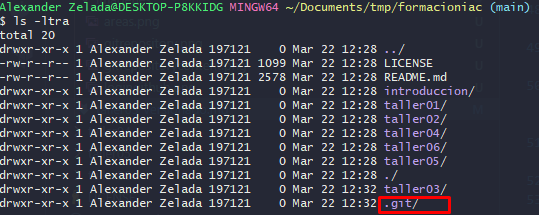
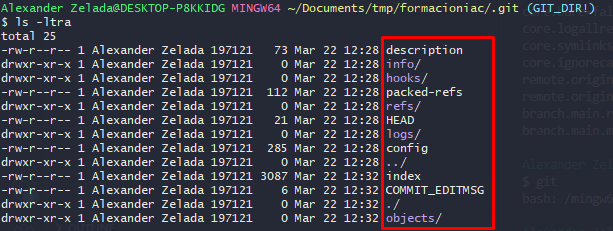
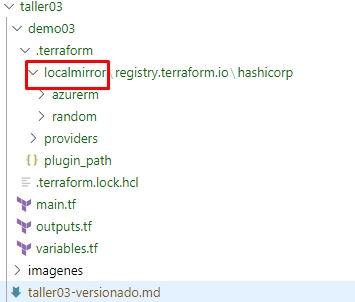

## **Parte 1 - Git**

Git es un sistema de control de versiones que te permite llevar un registro completo de los cambios que realizas en tus proyectos.

## Instalar:

**Ubuntu**:

Para instalar Git en Ubuntu, sigue estos pasos:

1. Abre una terminal
2. Ejecuta el siguiente comando: **`sudo apt-get update`**
3. Luego, ejecuta este otro comando: **`sudo apt-get install git`**

**Windows:**

Para instalar Git en Windows, sigue estos pasos:

1. Descarga el instalador de Git desde **[https://git-scm.com/download/win](https://git-scm.com/download/win)**
2. Ejecuta el archivo descargado y sigue las instrucciones del instalador.

## **Autenticación**

Para poder utilizar Git, es importante que configures tu nombre y correo electrónico en la línea de comando. Esto es lo que Git usará para identificar quién realizó cada cambio en el proyecto. Para hacerlo, ejecuta los siguientes comandos, reemplazando los valores entre comillas con tus propias credenciales:

```bash
git config --global user.email "xxxxxxxx.xxxxx@gmail.com"
git config --global [user.name](http://user.name/) "lzeladam"
```

## **Los tres estados**

Git tiene tres estados: el "Working Directory", el "Staging Area" y el "Repositorio Local". Estos estados representan diferentes puntos en el proceso de guardar cambios en tu proyecto.


- **Working Directory**: Es donde haces cambios a tus archivos. Los archivos en este estado no se han agregado a la zona de preparación (staging area).
- **Staging Area**: Es una zona intermedia entre el “Working Directory” y el “Local Repository”. Cuando haces un **`git add`**, estás agregando los cambios de tu “Working Directory” a esta zona.
- **Local Repository**: Es donde Git guarda un registro completo de los cambios que has realizado. Cuando haces un **`git commit`**, estás guardando los cambios del “Staging Area” en el “Repositorio Local”, vendría a ser la carpeta “.git”.
  
  - El Local Repository está ubicado en la carpeta oculta .git
  


  - Contenido de Local Repository
  


## Comandos Basicos

1. **`git init`**: Inicializa un nuevo repositorio Git vacío en la carpeta actual.
2. **`git add`**: Añade cambios al área de preparación (staging area) para ser incluidos en el próximo commit.
3. **`git commit`**: Guarda los cambios realizados en el “Staging Area” en el repositorio.
4. **`git status`**: Muestra el estado actual del repositorio, incluyendo archivos modificados, archivos en el “Staging Area” y archivos sin seguimiento.
5. **`git diff`**: Muestra las diferencias entre los archivos en el “Staging Area” y los archivos en el repositorio.
6. **`git branch`**: Lista las ramas existentes y crea nuevas ramas.
7. **`git checkout`**: Cambia de rama o restaura un archivo a una versión anterior.
8. **`git merge`**: Combina los cambios realizados en una rama con otra rama.
9. **`git pull`**: Obtiene los cambios desde un repositorio remoto y los fusiona con el repositorio local.
10. **`git push`**: Sube los cambios realizados en el repositorio local al repositorio remoto.
11. **`git clone`**: Crea una copia local de un repositorio remoto.

## **Parte 2 - Terraform**
## Comandos Basicos

1. **`terraform init`**: Inicializa el directorio de trabajo de Terraform y descarga los proveedores de nube necesarios.
2. **`terraform plan`**: Crea un plan de ejecución que muestra los cambios que se realizarán en la infraestructura según el código de Terraform.
3. **`terraform apply`**: Aplica los cambios definidos en el código de Terraform y crea la infraestructura.
4. **`terraform destroy`**: Destruye la infraestructura creada por Terraform.
5. **`terraform validate`**: Valida la sintaxis del código de Terraform.
6. **`terraform state`**: Gestiona el estado de la infraestructura creada por Terraform.
7. **`terraform import`**: Importa recursos existentes de proveedores de nube a la configuración de Terraform.
8. **`terraform fmt`**: Reformatear el código respetando el estilo Terraform.
9. **`terraform force-unlock`**: Forzar el desbloqueo del estado en el workspace actual.
10. **`terraform plan --var-file="valores.tfvars"`**: Especificar un archivo de variables de Terraform.
11. **`terraform apply --target=aws_instance.example`**: Si deseas aplicar los cambios solo a un recurso específico, puedes utilizar la opción **`-target`** seguido del nombre del recurso.
    
## Terraform state

El estado (state) de Terraform es una representación de los recursos de infraestructura definidos en un archivo de configuración en un momento determinado. Este estado se almacena en un archivo local denominado **`terraform.tfstate`**, o en un backend remoto si se configura uno.

El estado se utiliza para realizar un seguimiento de la infraestructura que se ha creado con Terraform y para determinar qué recursos han sido creados, modificados o eliminados. Terraform compara el estado actual con el estado anterior para determinar qué cambios deben aplicarse a la infraestructura.

Listar todos los recursos del terraform.state

```bash
terraform state list
########### OUTPUT ############
data.azurerm_resource_group.rg
azurerm_container_registry.acr
azurerm_linux_virtual_machine.linux_vm
azurerm_marketplace_agreement.gitlabee
azurerm_network_interface.nic_linux_vm
azurerm_network_interface.nic_windows
azurerm_network_security_group.internal_nsg
azurerm_public_ip.vpn-gateway-pip
azurerm_subnet.gateway-subnet
azurerm_subnet.internal_subnet
azurerm_subnet_network_security_group_association.internal_subnet_nsg_association
azurerm_virtual_network.virtual_network
azurerm_windows_virtual_machine.windows_vm
```

Mostrar los recursos:

```bash
terraform state show azurerm_windows_virtual_machine.windows_vmç
############### OUTPUT #########################
# azurerm_windows_virtual_machine.windows_vm:
resource "azurerm_windows_virtual_machine" "windows_vm" {
    admin_password             = (sensitive value)
    admin_username             = "adminuser"
    allow_extension_operations = true
    computer_name              = "taller02-win-vm"
    enable_automatic_updates   = true
    encryption_at_host_enabled = false
    extensions_time_budget     = "PT1H30M"
    hotpatching_enabled        = false
    id                         = "/subscriptions/9a392b6d-8383-4bbe-bf50-bed482d1792c/resourceGroups/GR_LABS/providers/Microsoft.Compute/virtualMachines/taller02-win-vm"
    location                   = "eastus2"
    max_bid_price              = -1
    name                       = "taller02-win-vm"
    network_interface_ids      = [
        "/subscriptions/9a392b6d-8383-4bbe-bf50-bed482d1792c/resourceGroups/GR_LABS/providers/Microsoft.Network/networkInterfaces/taller02-nic-internal-windows",
    ]
    patch_mode                 = "AutomaticByOS"
    platform_fault_domain      = -1
    priority                   = "Regular"
    private_ip_address         = "10.0.2.5"
    private_ip_addresses       = [
        "10.0.2.5",
    ]
    provision_vm_agent         = true
    public_ip_addresses        = []
    resource_group_name        = "GR_LABS"
    secure_boot_enabled        = false
    size                       = "Standard_F2"
    virtual_machine_id         = "17288379-9dec-4abf-b05d-2a53747f7ae0"
    vtpm_enabled               = false

    os_disk {
        caching                   = "ReadWrite"
        disk_size_gb              = 127
        name                      = "taller02-win-vm_OsDisk_1_f79ce3292dab4b89b6285293bd5ba6d1"
        storage_account_type      = "Standard_LRS"
        write_accelerator_enabled = false
    }

    source_image_reference {
        offer     = "WindowsServer"
        publisher = "MicrosoftWindowsServer"
        sku       = "2016-Datacenter"
        version   = "latest"
    }
}
```

El comando en particular es "terraform state rm", que se utiliza para eliminar un recurso de la configuración de estado de Terraform.

```bash
terraform state rm azurerm_network_interface.nic_windows
########################## OUTPUT #####################
Acquiring state lock. This may take a few moments...
Removed azurerm_network_interface.nic_windows
Successfully removed 1 resource instance(s).
Releasing state lock. This may take a few moments...
```

El comando "terraform state pull", se utiliza para descargar y mostrar el estado actual de la infraestructura administrada por Terraform. La opción "> terraform.tfstate" redirige la salida del comando al archivo "terraform.tfstate", que se creará si no existe o se sobrescribirá si ya existe.

```bash
terraform state pull > terraform.tfstate
```

El comando "terraform state push", se utiliza para actualizar el estado de la infraestructura administrada por Terraform con los valores almacenados en el archivo "terraform.tfstate". Este comando es útil cuando se ha realizado un cambio en el archivo "terraform.tfstate" fuera del entorno de Terraform y se desea actualizar el estado de la infraestructura con esos cambios.

```bash
terraform state push terraform.tfstate
```

El comando "terraform force-unlock", se utiliza para forzar la liberación de un bloqueo de estado de Terraform. El bloqueo de estado se utiliza para asegurar que no se realicen cambios simultáneos en la infraestructura de Terraform, lo que podría provocar conflictos y errores. Si por alguna razón el bloqueo no se ha liberado adecuadamente, este comando puede utilizarse para forzar la liberación del bloqueo.

```bash
terraform force-unlock [options] LOCK_ID
```

## Providers:

En Terraform, **`required_providers`** y **`provider`** son dos secciones distintas que tienen diferentes propósitos y funciones.

La sección **`required_providers`** se utiliza para definir qué proveedores de recursos se necesitan en un archivo de configuración. Esta sección se encuentra en la raíz del archivo de configuración y se utiliza para declarar los proveedores que el archivo de configuración requiere para poder interactuar con los recursos de la nube.

Por ejemplo, si quieres usar Terraform para crear recursos en Azure, necesitas declarar el proveedor de Azure en la sección **`required_providers`**. La definición del proveedor indica a Terraform qué versión del proveedor se necesita y cómo se accede a él.

Aquí tienes un ejemplo de la sección **`required_providers`** para el proveedor de Azure:

```bash
required_providers {
  azurerm = {
    source  = "hashicorp/azurerm"
    version = "=2.62.0"
  }
}
```

Por otro lado, la sección **`provider`** se utiliza para configurar un proveedor de recursos específico en un archivo de configuración. Esta sección se utiliza para definir las credenciales de autenticación, la región, la versión del proveedor, entre otras opciones.

Por ejemplo, si quieres utilizar Terraform para crear un recurso de Azure Blob Storage, necesitas configurar el proveedor de Azure en la sección **`provider`**. La configuración del proveedor indica a Terraform cómo autenticarse con la cuenta de Azure y cómo acceder al recurso.

Aquí tienes un ejemplo de la sección **`provider`** para el proveedor de Azure:

```bash
provider "azurerm" {
  features {}

  subscription_id = "12345678-90ab-cdef-ghij-klmnopqrstuv"
  client_id       = "12345678-90ab-cdef-ghij-klmnopqrstuv"
  client_secret   = "12345678-90ab-cdef-ghij-klmnopqrstuv"
  tenant_id       = "12345678-90ab-cdef-ghij-klmnopqrstuv"
}
```

En resumen, la sección **`required_providers`** se utiliza para definir los proveedores de recursos necesarios en un archivo de configuración, mientras que la sección **`provider`** se utiliza para configurar un proveedor de recursos específico con opciones de configuración como credenciales de autenticación, región, versión del proveedor, entre otras.

## Backend

En el caso de Azure, se puede utilizar el backend de Azure Blob Storage para almacenar los estados de Terraform. Para ello, primero es necesario crear una cuenta de almacenamiento en Azure. Una vez creada la cuenta de almacenamiento, se debe configurar el archivo de configuración de Terraform para que use el backend de Azure. Esto se puede hacer agregando las siguientes líneas al archivo de configuración de Terraform:

```bash
terraform {
    required_providers {
      azurerm = {
        source  = "hashicorp/azurerm"
        version = "~>3.0.0"
      }
    }
    backend "azurerm" {
      resource_group_name  = "GR_LABS" #NOMBRE_RESOURCE_GROUP
      storage_account_name = "backendtfsate" #"NOMBRE_CUENTA_ALMACENAMIENTO"
      container_name       = "tfstate" #"NOMBRE_CONTENEDOR"
      key                  = "demo02.tfstate" #"NOMBRE_ARCHIVO_DE_ESTADO.tfstate"
    }
  }
```

Una vez que se ha configurado el backend de Azure, se puede utilizar Terraform como de costumbre para definir y gestionar la infraestructura de Azure. Al ejecutar los comandos de Terraform, el estado de los recursos se almacenará en el archivo de estado en el backend de Azure.

## Demo Git

## Ejecutar terraform provider sin acceso a internet

Crea la carpeta localmirror en la siguiente ruta:



La opción "-plugin-dir=./.terraform/localmirror" especifica que los plugins deben descargarse desde un directorio local llamado "localmirror" ubicado en el directorio actual. Esto puede ser útil si se desea utilizar una fuente local para los plugins en lugar de descargarlos desde Internet.

```bash
terraform init -plugin-dir=./.terraform/localmirror
```

 El comando "terraform providers mirror" se utiliza para crear un espejo local de proveedores de Terraform. Esto puede mejorar la seguridad y la eficiencia al descargar los proveedores localmente y evitar la necesidad de descargarlos desde Internet.

```bash
terraform providers mirror -plugin-dir=./.terraform/localmirror
terraform providers mirror -platform=windows_386  ./.terraform/localmirror
```