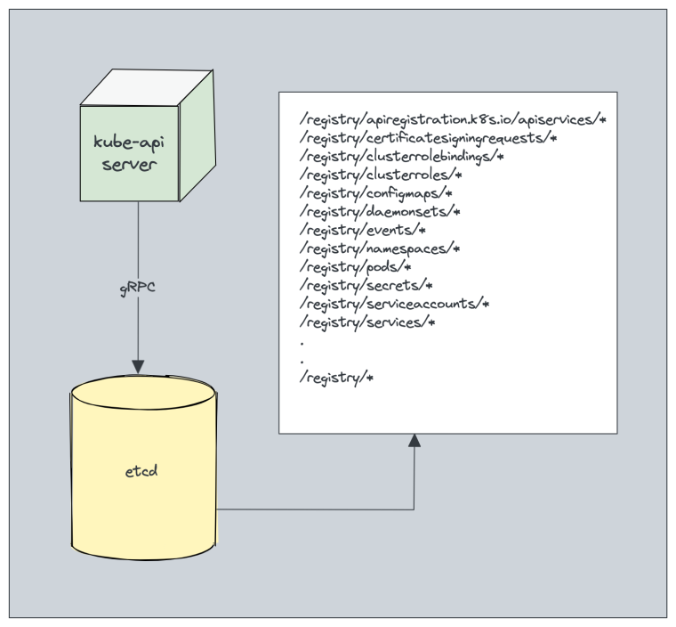
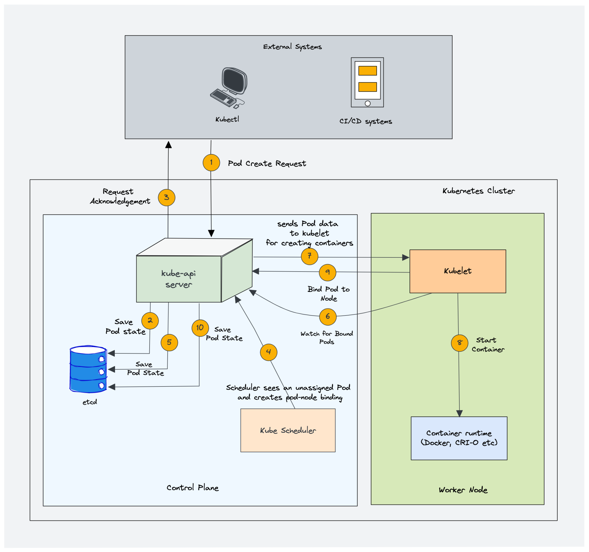
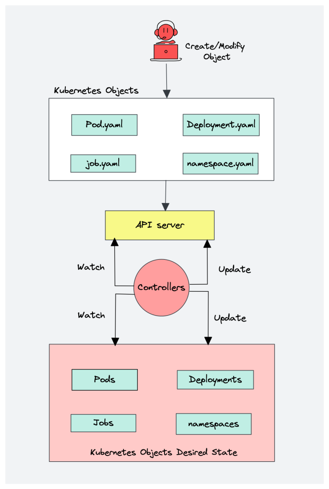
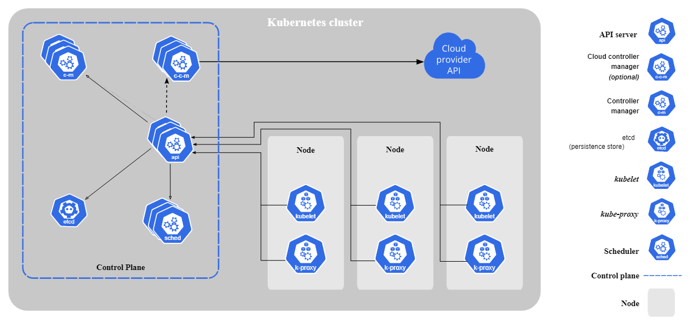
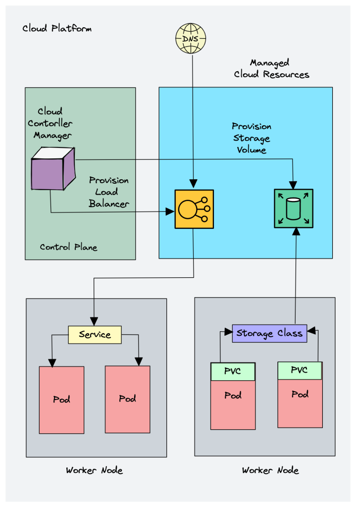
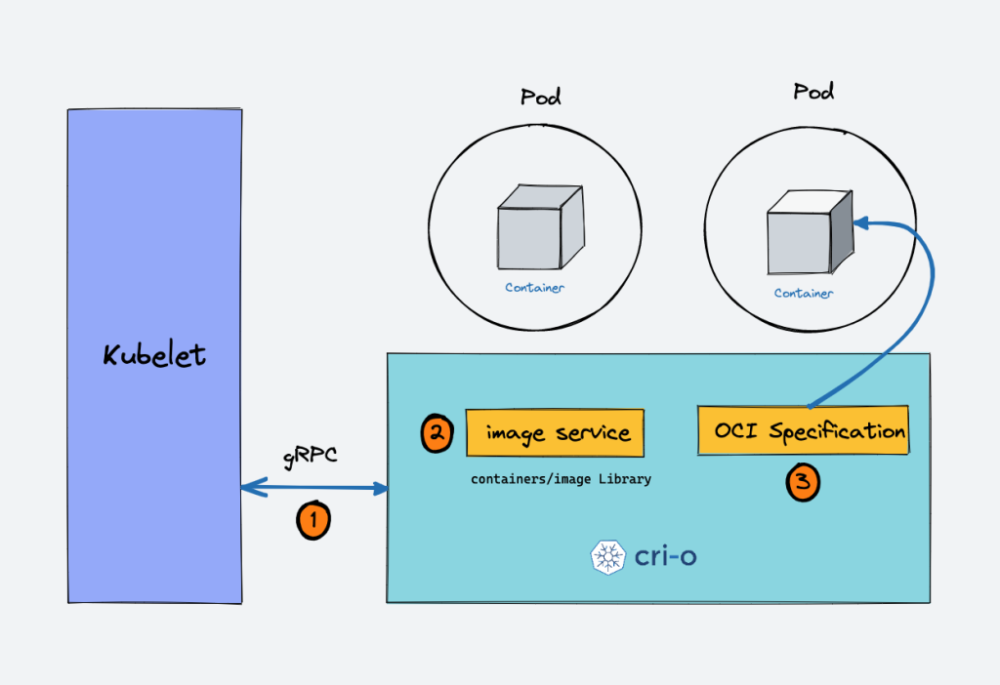
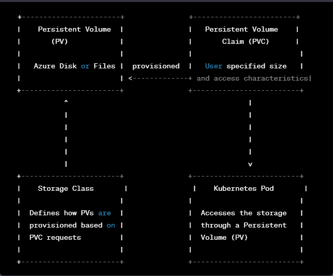
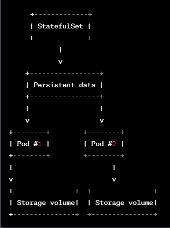
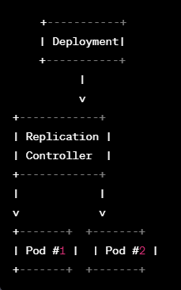

# Introducción a Kubernetes (K8s)
Kubernetes es una plataforma de orquestación de contenedores de código abierto que automatiza el despliegue, la escalabilidad y la gestión de aplicaciones en contenedores. Permite que los desarrolladores y los equipos de operaciones de TI puedan trabajar juntos de forma más eficiente y ágil.

## ¿Por qué usar Kubernetes?
Kubernetes simplifica el proceso de implementación y gestión de aplicaciones en contenedores, lo que significa que los equipos pueden centrarse en escribir código y no en administrar servidores y configuraciones de red. Algunas de las ventajas de utilizar Kubernetes incluyen:

Escalabilidad: Kubernetes permite que las aplicaciones se escalen automáticamente en función de la demanda, lo que significa que las aplicaciones pueden manejar más tráfico sin interrupciones.

Resiliencia: Kubernetes monitorea continuamente las aplicaciones y los contenedores y garantiza que se ejecuten correctamente. Si un contenedor falla, Kubernetes puede reiniciarlo automáticamente.

Portabilidad: Kubernetes se puede ejecutar en cualquier lugar, lo que significa que las aplicaciones se pueden mover fácilmente entre diferentes entornos, desde la nube pública hasta el centro de datos local.

## Arquitectura de Kubernetes
 Tomado de Kubernetes Architecture Explained Devopscube.com


### **Control Plane**

Es responsable de gestionar el estado del clúster, programar y escalar aplicaciones, y garantizar que los recursos estén en el estado deseado. Los componentes principales del plano de control de Kubernetes son los siguientes:

**Kubernetes Control Plane Components**

1. **Kube-apiserver**: componente que expone la API de Kubernetes. Cuando alguien quiere hacer algo en el clúster, como crear un nuevo objeto (como un pod o un servicio), actualizar el estado de un objeto existente o eliminar un objeto, lo hace a través del kube-apiserver.
    
    En resumen, cuando usas kubectl para gestionar el clúster de Kubernetes, en realidad estás comunicándote con el servidor de API a través de HTTP REST APIs. Pero los componentes internos del clúster, como el planificador, el controlador, etc., se comunican con el servidor de API a través de gRPC.
    
    <aside>
    🗃️ gRPC es un framework de comunicación remota de alta velocidad y de código abierto desarrollado por Google
    
    </aside>
    

 
Tomado de Kubernetes Architecture Explained Devopscube.com

1. **Etcd**: 
   
   Es una base de datos de clave-valor distribuida y consistente que se utiliza en Kubernetes para almacenar y gestionar el estado del clúster. Es considerado el "cerebro" del control plane de Kubernetes ya que es la fuente única y fiable de la verdad para todos los componentes del plano de control.
    * **Key-value store**: A diferencia de las bases de datos SQL, el modelo de datos de etcd es sencillo, involucrando claves y valores en lugar de relaciones de datos arbitrarias. Esto ayuda a garantizar un rendimiento relativamente predecible, al menos en comparación con las bases de datos SQL tradicionales.
    * **Consistencia**: etcd proporciona una consistencia fuerte (strongest consistency) en todas las operaciones de lectura y escritura, lo que significa que todos los nodos ven los mismos datos en todo momento.
    * **Distribuido**: A diferencia de las bases de datos SQL tradicionales, etcd está diseñado desde cero para ser ejecutado con múltiples nodos. El diseño particular de etcd permite una alta disponibilidad (aunque no del 100%) sin sacrificar la consistencia.
    
    **¿Cómo funciona?**
    
    El secreto detrás del equilibrio de etcd entre consistencia sólida y alta disponibilidad es el algoritmo Raft.
    
    Raft funciona eligiendo un líder y asegurándose de que todas las solicitudes de escritura vayan al líder para evitar conflictos.
    
    > 🗃️ Si estás interesado en los detalles, aquí hay un excelente recorrido visual. [http://thesecretlivesofdata.com/raft/](http://thesecretlivesofdata.com/raft/) 
    
    En resumen, esto es lo que necesitas saber sobre etcd.
    
    1. etcd almacena todas las configuraciones, estados y metadatos de los objetos de Kubernetes (pods, secrets, daemonsets, deployments, configmaps, statefulsets, etc.).
    2. etcd permite que un cliente se suscriba a eventos utilizando la API Watch(). El servidor API de Kubernetes utiliza la funcionalidad de watch de etcd para realizar un seguimiento de los cambios en el estado de un objeto.
    3. etcd expone una API clave-valor mediante gRPC. Además, el gateway gRPC es un proxy RESTful que traduce todas las llamadas de API HTTP en mensajes gRPC. Esto lo convierte en una base de datos ideal para Kubernetes.
    4. etcd almacena todos los objetos en formato clave-valor bajo la clave /registry/directory. Por ejemplo, la información sobre un pod llamado Nginx en el namspace por default se puede encontrar en /registry/pods/default/nginx.
        
         
        Tomado de Kubernetes Architecture Explained Devopscube.com
        
2. **kube-scheduler**
        
    Responsable de programar los pods en los worker nodes. Cuando se implementa un pod, se especifican los requisitos del pod, como la CPU, la memoria, la afinidad, los taints o tolerations, la prioridad, los volúmenes persistentes (PV), etc. La tarea principal del scheduler es identificar la solicitud de creación y elegir el mejor nodo para un pod que cumpla con los requisitos.
         
        Tomado de Kubernetes Architecture Explained Devopscube.com 
        
3. **Kube Controller Manager**
        
    ¿Qué es un controller? Los controladores son programas que ejecutan bucles de control infinitos. Esto significa que se ejecutan continuamente y supervisan el estado real y deseado de los objetos. Si hay una diferencia entre el estado real y deseado, se asegura de que el recurso/objeto de Kubernetes esté en el estado deseado.
        
    El Kube Controller Manager es un componente que administra todos los controladores de Kubernetes. Los recursos/objetos de Kubernetes como pods, namespaces, jobs y replicaset son gestionados por controladores respectivos. Además, el **kube-scheduler** también es un controlador gestionado por el administrador de controladores de Kube.
        
     
    Tomado de Kubernetes Architecture Explained Devopscube.com
        
4. **Cloud Controller Manager (CCM)**
        
    Es un componente de Kubernetes que actúa como un puente entre las APIs de la plataforma en la nube y el clúster de Kubernetes. Esto permite que los componentes centrales de Kubernetes trabajen de manera independiente y permiten a los proveedores de servicios en la nube integrarse con Kubernetes mediante complementos.
        
    En esencia, Cloud Controller Manager se encarga de gestionar los recursos de la nube en nombre de Kubernetes. Por ejemplo, puede provisionar instancias de nodos en la nube, load balancers y Storage Volumes ( for persistent volumes)
        
     
    Tomado de Kubernetes Architecture Explained Devopscube.com
        
    Para ello, Cloud Controller Manager se comunica con la API de la plataforma en la nube para crear, actualizar o eliminar recursos de la nube de acuerdo con los cambios en el estado de los objetos de Kubernetes. Esto permite que los clústeres de Kubernetes se integren con diferentes proveedores de servicios en la nube, lo que a su vez permite una mayor flexibilidad y portabilidad en la nube.
        
     
    Tomado de Kubernetes Architecture Explained Devopscube.com

          
    ## **Kubernetes Worker Node Components**
        
5. **Kubelet**
        
    Es un componente fundamental que se ejecuta en cada nodo de un clúster de Kubernetes. Su función principal es la de actuar como un agente de nodo, es decir, gestionar y supervisar el estado de los pods que se están ejecutando en ese nodo en particular. Para lograr esto, el kubelet se comunica con el Api Server de Kubernetes para recibir los PodSpecs que describen los pods que deben ejecutarse en ese nodo.
        
    El kubelet utiliza un objeto YAML o JSON llamado PodSpec para describir los detalles del pod, como cuántos contenedores deben ejecutarse y qué recursos de hardware necesitan. El kubelet toma una lista de PodSpecs proporcionados por el servidor API y se asegura de que los contenedores dentro de esos PodSpecs se estén ejecutando y sean saludables.
        
    ```yaml
        apiVersion: v1
        kind: Pod
        metadata:
          name: mi-pod
        spec:
          containers:
            - name: mi-contenedor
              image: mi-imagen:latest
              ports:
                - containerPort: 8080
    ```
        
    El kubelet utiliza CNI (Container Networking Interface) para administrar la conectividad de red de los pods en el clúster de Kubernetes. Cuando se crea un pod, el kubelet utiliza el plugin CNI configurado en el clúster para asignar una dirección IP al pod y establecer la conectividad de red necesaria para que el pod pueda comunicarse con otros recursos dentro y fuera del clúster. El plugin de CNI seleccionado por el kubelet es responsable de crear y configurar las interfaces de red virtuales necesarias para el pod y de asegurar que se configuren correctamente para que el pod pueda comunicarse con el mundo exterior.
        
     
    Tomado de Kubernetes Architecture Explained Devopscube.com
        
6. **Kube proxy**
        
    Kube-proxy es un componente de Kubernetes que se encarga de implementar el concepto de servicios para los pods que se ejecutan en un clúster de Kubernetes. Es un daemon que se ejecuta en cada nodo del clúster como un daemonset, lo que garantiza que esté presente en cada nodo.
        
    El servicio en Kubernetes es una forma de exponer un conjunto de pods internamente o al tráfico externo. Cuando se crea el objeto de servicio, se le asigna una dirección IP virtual llamada clusterIP, que solo es accesible dentro del clúster de Kubernetes
        
     
    Tomado de Kubernetes Architecture Explained Devopscube.com
        
 7. **Container Runtime**
        
    En Kubernetes, el Container Runtime es el componente responsable de ejecutar los contenedores dentro de los Pods. El Container Runtime se comunica con el kubelet a través de la API CRI (Container Runtime Interface), que define un conjunto de operaciones que el kubelet puede realizar en el runtime.
        
    El Container Runtime se encarga de descargar la imagen del contenedor, crear el contenedor y ejecutar el proceso dentro de él. También se encarga de administrar los recursos del contenedor, como el uso de CPU y memoria.
        
    Kubernetes admite varios Container Runtimes, como Docker, CRI-O y containerd. Los runtimes son intercambiables y pueden ser reemplazados según las necesidades de la organización.
        
    Aquí hay una descripción general de alto nivel de cómo funciona el tiempo de ejecución de contenedores con Kubernetes CRI-O.
        
     
    Tomado de Kubernetes Architecture Explained Devopscube.com
        
    * Cuando hay una nueva solicitud de un pod desde el servidor API, el kubelet se comunica con el demonio CRI-O para lanzar los contenedores necesarios a través de la Interfaz de tiempo de ejecución de contenedor de Kubernetes.
    * CRI-O verifica y descarga la imagen del contenedor requerida desde el registro de contenedor configurado utilizando la biblioteca containers/image.
    * CRI-O luego genera la especificación de tiempo de ejecución OCI (JSON) para un contenedor.
    * CRI-O luego lanza un tiempo de ejecución compatible con OCI (runc) para iniciar el proceso del contenedor según la especificación de tiempo de ejecución.


### **Almacenamiento persistente en Azure Kubernetes Service (AKS)**


**Persistent Volume (PV)**

Un Persistent Volume (PV) es una unidad de almacenamiento en el clúster que ha sido aprovisionada por un administrador o dinámicamente mediante una Storage Class. Representa un recurso en el clúster de Kubernetes que se utiliza para almacenar datos de forma persistente. Los PV están asociados a un almacenamiento físico en Azure, como Azure Disk o Azure Files.

**Persistent Volume Claim (PVC)**

Un Persistent Volume Claim (PVC) es una solicitud de almacenamiento por parte de un usuario. Los PVC solicitan un volumen persistente de un tamaño específico y características de acceso (lectura, escritura, etc.). Cuando un PVC es creado y enlazado a un PV, el almacenamiento se asigna y está disponible para ser utilizado por los pods en el clúster de Kubernetes.

**Storage Class**

Una Storage Class es una abstracción que define cómo se aprovisionan los PV en función de las solicitudes de los PVC. Se utiliza para describir y clasificar las diferentes opciones de almacenamiento disponibles en el clúster. Los administradores pueden definir varias Storage Classes para diferentes tipos y configuraciones de almacenamiento en Azure, como Azure Disk con diferentes niveles de rendimiento (Standard, Premium, etc.) o Azure Files. Cuando un PVC solicita un volumen persistente, el sistema de Kubernetes selecciona y aprovisiona dinámicamente un PV que cumpla con los requisitos de la Storage Class solicitada.

**Almacenamiento físico en AKS**

El almacenamiento físico en AKS se refiere a los servicios de almacenamiento en la nube de Azure que se utilizan para aprovisionar los PV. Estos servicios incluyen Azure Disk y Azure Files, entre otros. Estos servicios de almacenamiento son gestionados por Azure y están disponibles para su uso en clústeres de Kubernetes.

**Resumen**

En resumen, un PVC es una solicitud de almacenamiento de un usuario en un clúster de Kubernetes. El clúster utiliza las Storage Classes para determinar cómo se aprovisiona un PV en función de la solicitud del PVC. Los PV están respaldados por almacenamiento físico en Azure, como Azure Disk o Azure Files. Cuando un PVC se enlaza a un PV, el almacenamiento está disponible para ser utilizado por los pods en el clúster.

 

### **Explicación de StatefulSet, DaemonSet y Deployment en Kubernetes**

**StatefulSet:**

Un StatefulSet es un controlador de alto nivel en Kubernetes que se utiliza para administrar aplicaciones con estado. A diferencia de un Deployment, que no garantiza el orden de despliegue y la identidad única de los pods, un StatefulSet garantiza que los pods se creen en un orden secuencial y mantengan una identidad única y persistente. Esto es útil para aplicaciones que requieren un estado persistente, como bases de datos y sistemas de almacenamiento distribuido.

**Casos de uso:**

Bases de datos (por ejemplo, MongoDB, PostgreSQL, MySQL)
Sistemas de almacenamiento distribuido (por ejemplo, Apache Cassandra, Apache ZooKeeper)
Cuándo utilizar un StatefulSet:

Utiliza un StatefulSet cuando necesites mantener un estado persistente y una identidad única entre los pods de tu aplicación. Los StatefulSets garantizan el orden de despliegue y la identidad de los pods, lo que los hace ideales para aplicaciones con estado como bases de datos y sistemas de almacenamiento distribuido.

 

**DaemonSet:**

Un DaemonSet es un controlador que garantiza que un pod en particular se ejecute en todos (o en algunos) nodos del clúster. Cuando se agrega un nuevo nodo al clúster, automáticamente se crea un nuevo pod para ese nodo. Si un nodo se elimina del clúster, también se eliminarán los pods asociados. Los DaemonSets son útiles para ejecutar tareas de administración y monitoreo en todos los nodos del clúster.

**Casos de uso:**

Monitoreo de nodos y recolección de métricas (por ejemplo, Prometheus Node Exporter)
Administración de registros y envío de registros a sistemas centralizados (por ejemplo, Fluentd, Logstash)
Implementación de agentes de seguridad y red (por ejemplo, agentes de firewall, agentes de protección de puntos finales)
Cuándo utilizar un DaemonSet:

Utiliza un DaemonSet cuando necesites ejecutar una instancia de un pod en todos (o en algunos) nodos del clúster. Los DaemonSets son ideales para tareas de monitoreo, administración de registros y agentes de seguridad que deben estar presentes en cada nodo.

 


**Deployment:**

Un Deployment es un controlador que se utiliza para administrar aplicaciones sin estado en Kubernetes. Los Deployments permiten escalar horizontalmente las aplicaciones, actualizarlas y revertir a versiones anteriores. Los pods creados por un Deployment no tienen una identidad única y persistente, lo que los hace ideales para aplicaciones que no necesitan mantener un estado persistente entre reinicios.

**Casos de uso:**

Aplicaciones web sin estado (por ejemplo, servidores web, aplicaciones front-end)
Microservicios sin estado y APIs REST
Procesamiento en segundo plano y trabajos de cola
Cuándo utilizar un Deployment:

Utiliza un Deployment cuando necesites administrar aplicaciones sin estado que se puedan escalar horizontalmente y no requieran una identidad única entre los pods. Los Deployments son ideales para aplicaciones web, microservicios y trabajos de procesamiento en segundo plano que no mantienen un estado persistente.

 


# Lens

Seguir los pasos para instalar Lens:

https://docs.k8slens.dev/getting-started/install-lens/


# Enlaces de Interés
https://devopscube.com/kubernetes-architecture-explained/

https://www.redhat.com/en/topics/containers/kubernetes-architecture

https://kubernetes.io/docs/tasks/tools/install-kubectl-windows/#install-kubectl-binary-with-curl-on-windows

https://learn.microsoft.com/es-es/azure/developer/terraform/create-k8s-cluster-with-tf-and-aks


