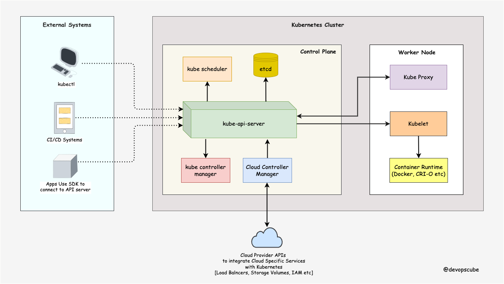

# Introducción a Kubernetes (K8s)
Kubernetes es una plataforma de orquestación de contenedores de código abierto que automatiza el despliegue, la escalabilidad y la gestión de aplicaciones en contenedores. Permite que los desarrolladores y los equipos de operaciones de TI puedan trabajar juntos de forma más eficiente y ágil.

## ¿Por qué usar Kubernetes?
Kubernetes simplifica el proceso de implementación y gestión de aplicaciones en contenedores, lo que significa que los equipos pueden centrarse en escribir código y no en administrar servidores y configuraciones de red. Algunas de las ventajas de utilizar Kubernetes incluyen:

Escalabilidad: Kubernetes permite que las aplicaciones se escalen automáticamente en función de la demanda, lo que significa que las aplicaciones pueden manejar más tráfico sin interrupciones.

Resiliencia: Kubernetes monitorea continuamente las aplicaciones y los contenedores y garantiza que se ejecuten correctamente. Si un contenedor falla, Kubernetes puede reiniciarlo automáticamente.

Portabilidad: Kubernetes se puede ejecutar en cualquier lugar, lo que significa que las aplicaciones se pueden mover fácilmente entre diferentes entornos, desde la nube pública hasta el centro de datos local.

## Arquitectura de Kubernetes

La arquitectura de Kubernetes consta de varios componentes principales que trabajan juntos para implementar y gestionar aplicaciones en contenedores.

Control Plane Components: These are the components responsible for managing the cluster's overall state. The control plane components include:
kube-apiserver: This component exposes the Kubernetes API and serves as the front-end for the control plane. It validates and processes requests from kubectl and other Kubernetes components.

etcd: This is the key-value store that Kubernetes uses to store its state. The API server reads and writes all cluster state into etcd.

kube-controller-manager: This component runs a set of controllers that are responsible for maintaining the desired state of the cluster. For example, the Replication Controller ensures that a specified number of pod replicas are running at all times.

kube-scheduler: This component assigns pods to nodes based on resource availability and scheduling requirements.

Node Components: These are the components that run on each node in the cluster. The node components include:
kubelet: This component is responsible for managing the state of each node in the cluster. It communicates with the API server to receive and execute pod manifests.

kube-proxy: This component is responsible for managing network routing on each node in the cluster. It maintains network rules and forwards traffic to the appropriate pod.

container runtime: This component is responsible for running containers on the node. Kubernetes supports several container runtimes, including Docker, CRI-O, and containerd.

Add-ons: These are optional components that provide additional functionality to the cluster. Some popular add-ons include:
kube-dns: This provides DNS resolution for services running in the cluster.

Dashboard: This provides a web-based user interface for managing the cluster.

Ingress Controller: This provides HTTP load balancing and proxying for services running in the cluster.

# Lens

Seguir los pasos para instalar Lens:

https://docs.k8slens.dev/getting-started/install-lens/

# Enlaces de Interés
https://devopscube.com/kubernetes-architecture-explained/

https://www.redhat.com/en/topics/containers/kubernetes-architecture

https://kubernetes.io/docs/tasks/tools/install-kubectl-windows/#install-kubectl-binary-with-curl-on-windows

https://learn.microsoft.com/es-es/azure/developer/terraform/create-k8s-cluster-with-tf-and-aks

