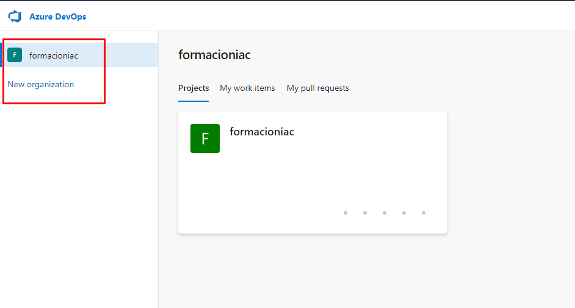
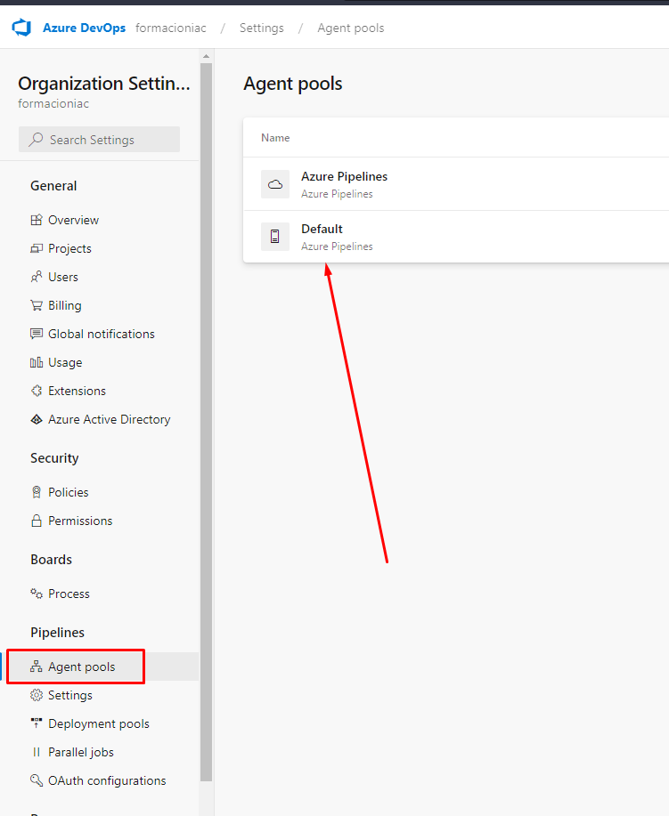
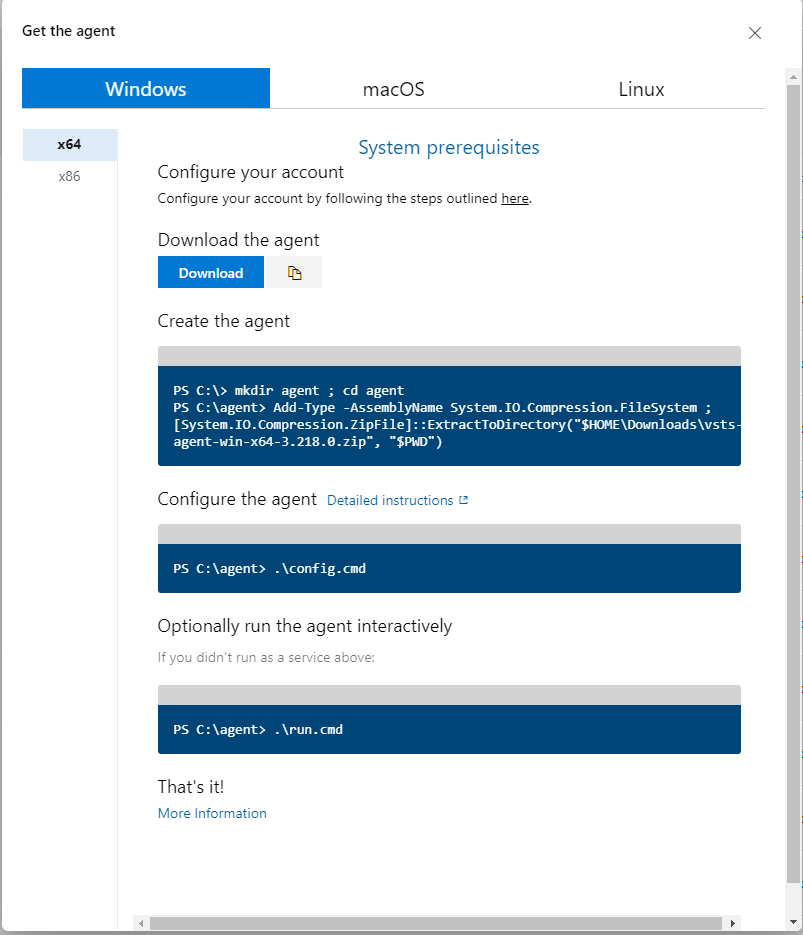
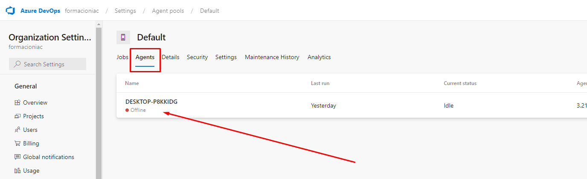
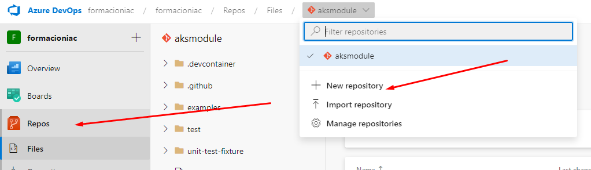
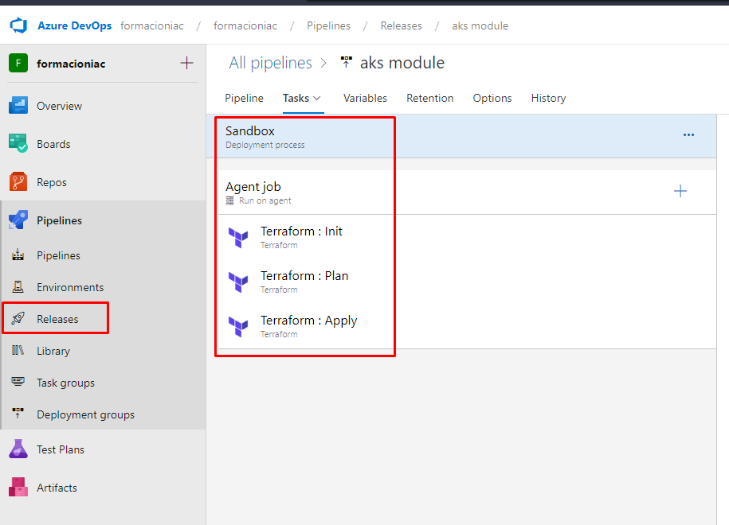

# Módulos de Terraform

**¿Qué son los módulos de Terraform?**

Los módulos de Terraform son bloques de código reutilizables que permiten organizar y gestionar la configuración de infraestructura de manera eficiente. Estos módulos encapsulan recursos (colección de archivos .tf) y sus configuraciones asociadas, facilitando su implementación y mantenimiento en múltiples entornos.

**Estructura de un módulo**

La estructura de un módulo de Terraform incluye los siguientes archivos:

- **`main.tf`**: Contiene las definiciones de los recursos y sus configuraciones.
- **`variables.tf`**: Define las variables de entrada del módulo.
- **`outputs.tf`**: Especifica los valores de salida del módulo.
- **`versions.tf`**: Establece las restricciones de versiones para los proveedores utilizados en el módulo.

**Modulos Hijos**

Un módulo de Terraform (generalmente el módulo raíz  o root de una configuración) puede llamar a otros módulos para incluir sus recursos en la configuración. Un módulo que ha sido llamado por otro módulo a menudo se denomina módulo hijo o child.

Llamada Local Child Module

```bash
module "servers" {
  source = "./app-cluster"

  servers = 5
}
```

Llamada GitHub Child Module

```bash
module "consul" {
  source = "github.com/hashicorp/example"
}
```

Version

```bash
module "consul" {
  source  = "hashicorp/consul/aws"
  version = "0.0.5"

  servers = 3
}
```

Recuperar el valor de un output de un modulo

```bash
resource "aws_elb" "example" {
  # ...

  instances = module.servers.instance_ids
}
```

**Módulos públicos**

Además de los módulos locales, Terraform puede cargar módulos desde un registro público o privado. Esto hace posible publicar módulos para que otros los usen, y usar módulos que otros hayan publicado.

El [Terraform Registry](https://registry.terraform.io/browse/modules) alberga una amplia colección de módulos de Terraform públicamente disponibles para configurar muchos tipos de infraestructura común.

**Cuando escribir un módulo**

Si el módulo no está aportando abstracción, es mejor usar el tipo de recurso directamente en el módulo de llamada en lugar de crear un módulo separado.

Ejemplos

- En lugar de definir un conjunto de recursos para crear un grupo de servidores web en una región de Azure, se puede crear un módulo que incluya varios grupos de servidores web y bases de datos. El módulo se encargará de manejar los detalles de implementación, como la creación del autoescalado, las configuraciones de seguridad y las relaciones de dependencia entre los recursos.
- En lugar de definir manualmente los recursos para crear un clúster de Kubernetes, se puede utilizar un módulo de Kubernetes que abstracta la complejidad de la creación de los diferentes objetos de Kubernetes, como pods, servicios y deployments. El módulo permite definir un clúster de Kubernetes de manera más simple y abstracta, a través de un conjunto de variables y parámetros.

# Introducción a Azure DevOps
Azure DevOps es una suite de servicios de colaboración para el desarrollo y entrega de software. Incluye las siguientes herramientas:
    
- Boards: Gestión de proyectos ágiles y seguimiento del trabajo.
- Repos: Repositorios de código fuente y control de versiones.
- Pipelines: Automatización de compilación, pruebas y despliegue de aplicaciones.
- Test Plans: Planificación y ejecución de pruebas manuales y exploratorias.
- Artifacts: Gestión de paquetes y dependencias de software.

**Crear Organización**

 

**Configuracion de pool agentes**
 


**Descargar del agente**
 

Crear el agente

```powershell
PS C:\> mkdir agent ; cd agent
PS C:\agent> Add-Type -AssemblyName System.IO.Compression.FileSystem ; [System.IO.Compression.ZipFile]::ExtractToDirectory("$HOME\Downloads\vsts-agent-win-x64-3.218.0.zip", "$PWD")
```

Configurar el agente

- URL del servidor y autenticación:
Cuando la configuración solicite la URL del servidor, para Azure DevOps Services, responda https://dev.azure.com/{su-organización}.

- Cuando la configuración solicite el tipo de autenticación, elija PAT. Luego, pegue el token PAT que creó en la ventana del símbolo del sistema.

```powershell
PS C:\agent> .\config.cmd
```

Ejecutamos el cliente

```powershell
PS C:\agent> .\run.cmd
```
Al final de estos pasos tendremos el agente en el estado online

**Configuracion del agente**
 

Ahora creamos el repositorio de git

**Repositorio de git**
 

**Creamos una release con los steps de la pipeline**
 

# Enlaces de Interés

https://developer.hashicorp.com/terraform/language/modules/develop

https://learn.microsoft.com/en-us/azure/devops/pipelines/agents/agents?view=azure-devops&tabs=browser

https://learn.microsoft.com/en-us/azure/devops/pipelines/agents/v2-windows?view=azure-devops