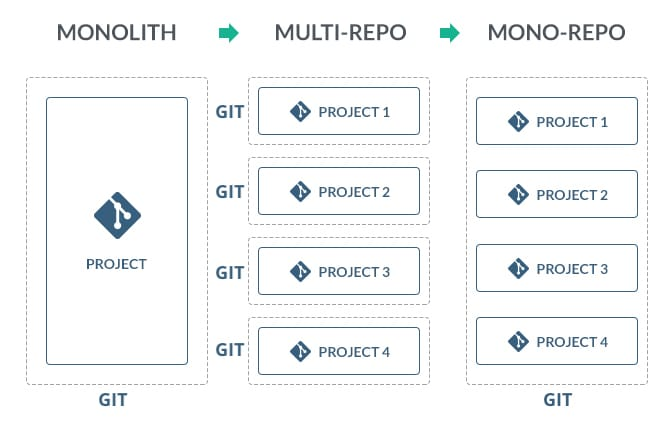

**1  Organización de Repositorios de Código: Estrategias para Estructurar y Administrar Proyectos de Software**

**1.1 Monorepositorios (Monorepos)**

**Ventajas:**

- Facilita la colaboración y comunicación: Permite a los equipos trabajar juntos de manera más eficiente y compartir información fácilmente.
- Simplifica la gestión de dependencias: Unifica la administración de bibliotecas y componentes compartidos, evitando incompatibilidades.
- Facilita la refactorización y mantenimiento: Cambios globales en el código son más sencillos de implementar y rastrear.

**Desventajas:**

- Problemas de escalabilidad y rendimiento: El crecimiento del repositorio puede ralentizar las operaciones y generar cuellos de botella.
- Dificulta la gestión de permisos: La granularidad de los accesos y restricciones es más complicada de administrar.
- Mayor riesgo de conflictos: La colaboración simultánea de varios equipos aumenta las posibilidades de conflictos en el código y dependencias cruzadas.

**1.2 Repositorios Múltiples (Multi-repos)**

**Ventajas:**

- Mejor gestión de permisos: Permite otorgar y controlar accesos granulares según las responsabilidades de cada equipo.
- Facilita la escalabilidad y rendimiento: La división del código en repositorios separados mejora la eficiencia en proyectos grandes.
- Menor riesgo de conflictos: La separación reduce las posibilidades de conflictos en el código y dependencias cruzadas.

**Desventajas:**

- Complica la comunicación y colaboración: La interacción entre equipos puede ser más difícil debido a la separación de repositorios.
- Dificulta la gestión de dependencias: La administración de bibliotecas y componentes compartidos puede volverse más compleja.
- Requiere más esfuerzo para coordinar: La sincronización y el mantenimiento de repositorios separados implica un esfuerzo adicional.

 

**2. GitOps: Automatización y Colaboración en la Gestión de Infraestructura utilizando Git**

En esencia, GitOps es una infraestructura basada en código y procedimientos operativos que utilizan Git como sistema de control de código fuente.

GitOps y [DevOps](https://www.redhat.com/es/topics/devops) comparten algunos principios y objetivos. DevOps se concentra en el cambio cultural y en ofrecer a los equipos de desarrollo y de operaciones la posibilidad de trabajar juntos de manera colaborativa.

GitOps le proporciona las herramientas y un marco para que aplique las prácticas de DevOps (como la colaboración, la CI/CD y el control de versiones) a la automatización de la infraestructura y la implementación de las aplicaciones. Los desarrolladores pueden trabajar en los repositorios de código que ya conocen, mientras que los equipos de operaciones se encargan de los demás elementos necesarios.

**2.1 Flux**

Flux es una herramienta de código abierto diseñada para implementar GitOps en entornos Kubernetes. Permite la automatización del despliegue continuo y la gestión de la configuración a partir de un repositorio Git. Flux se encarga de monitorear el repositorio y aplicar los cambios a la infraestructura de Kubernetes automáticamente, garantizando que el estado actual del clúster siempre coincida con el estado deseado definido en el repositorio Git.

Algunas características clave de Flux son:

- Sincronización de repositorio: Flux monitorea continuamente el repositorio Git en busca de cambios en la configuración y los aplica automáticamente al clúster de Kubernetes. Esto garantiza que el estado del clúster siempre esté sincronizado con la configuración almacenada en el repositorio.
- Despliegue automático de aplicaciones: Flux facilita el despliegue de aplicaciones en Kubernetes al automatizar el proceso de despliegue y actualización. Cuando se detecta una nueva versión de una aplicación en el repositorio Git, Flux la despliega automáticamente en el clúster.
- Gestión de la configuración: Flux gestiona la configuración de las aplicaciones y la infraestructura de Kubernetes mediante archivos declarativos almacenados en el repositorio Git. Esto permite a los equipos mantener un registro completo y auditable de la configuración y simplifica el proceso de colaboración y revisión de cambios.
- Recuperación automática: Si se producen discrepancias entre el estado actual del clúster y el estado deseado definido en el repositorio Git, Flux detecta y corrige automáticamente estas desviaciones, garantizando la consistencia y estabilidad del sistema.
- Integración con Helm: Flux se integra con Helm, el gestor de paquetes de Kubernetes, lo que facilita la administración de aplicaciones y la configuración de Helm en un entorno GitOps.

**3. Mejores Prácticas para la Gestión de Infraestructura y Código: Guías y Recomendaciones**

3.1 Terraform

[https://www.terraform-best-practices.com/](https://www.terraform-best-practices.com/)

3.2 Azure

[https://learn.microsoft.com/en-us/azure/architecture/guide/design-principles/](https://learn.microsoft.com/en-us/azure/architecture/guide/design-principles/)

3.3 Git

- Git Flow
  
    [https://www.atlassian.com/es/git/tutorials/comparing-workflows/gitflow-workflow](https://www.atlassian.com/es/git/tutorials/comparing-workflows/gitflow-workflow)

- Trunk-Based Development
    
    [https://trunkbaseddevelopment.com/](https://trunkbaseddevelopment.com/) 
    

# Enlaces de Interés

[https://fluxcd.io/](https://fluxcd.io/)

https://github.com/shuaibiyy/awesome-terraform

https://www.redhat.com/es/topics/devops/what-is-gitops